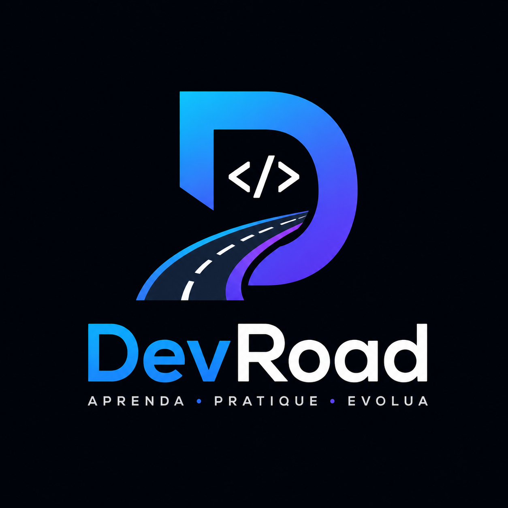

# 🚀 DevRoad

<p align="center">
  
</p>

<p align="center">


</p>

<p align="center">


</p>

<p align="center">
  <strong>Aprenda. Pratique. Evolua.</strong>
</p>

---

# 📖 Sobre o Projeto

O **DevRoad** é uma plataforma **Open Source** que organiza o aprendizado de programação por meio de trilhas estruturadas, reunindo vídeos gratuitos do YouTube, documentações oficiais, exercícios e projetos práticos em um único lugar.

A proposta é oferecer um caminho de aprendizado claro, organizado e acessível para qualquer pessoa que queira entrar ou evoluir na área de tecnologia.

> **🚧 Este projeto está em desenvolvimento e evoluirá junto com a minha jornada de estudos.**
>
> O DevRoad não é apenas um projeto de portfólio. Ele também representa minha evolução como desenvolvedor. À medida que eu aprender novas tecnologias, boas práticas e arquiteturas modernas, o projeto será continuamente aprimorado com novas funcionalidades, melhorias de desempenho e uma base de código cada vez mais sólida.
>
> Meu objetivo é construir uma plataforma realmente útil para a comunidade enquanto desenvolvo minhas habilidades em desenvolvimento Full Stack.

---

# ✨ Objetivos

* 📚 Organizar conteúdos gratuitos em uma sequência lógica.
* 🎥 Centralizar vídeos gratuitos do YouTube.
* 📖 Disponibilizar documentações oficiais.
* 💻 Sugerir projetos práticos.
* 📝 Criar exercícios para fixação.
* 📈 Permitir acompanhamento do progresso.
* 🌍 Tornar o projeto totalmente Open Source.
* 🚀 Evoluir continuamente junto com meus estudos.

---
# 🛠️ Stack Tecnológica

## Front-end

* Next.js 15
* React 19
* TypeScript
* Tailwind CSS
* Motion
* shadcn/ui

## Back-end

* Node.js
* Prisma ORM
* PostgreSQL 17
* Docker
* Docker Compose

## Banco de Dados

* PostgreSQL
* Prisma Migrations
* Prisma Client

## Ferramentas

* Git
* GitHub
* Vercel
* Docker Desktop
* Figma
* VS Code


## Banco de Dados

* PostgreSQL 17
* Prisma ORM
* Prisma Migrations
* Prisma Client
* Docker Compose

---

# ⚙️ Configuração do Ambiente

## Pré-requisitos

Antes de iniciar o projeto, tenha instalado:

* Node.js 22+
* Docker Desktop
* Git

---

## Instalação

Clone o repositório:

```bash
git clone https://github.com/MeirelesDiogo/DevRoad.git
Entre na pasta do projeto:

cd DevRoad

Instale as dependências:

npm install
Banco de Dados

O DevRoad utiliza PostgreSQL executado através de um container Docker.

Para iniciar o banco de dados:

docker compose up -d

O PostgreSQL ficará disponível em:

localhost:5432
Configuração das Variáveis de Ambiente

Crie um arquivo .env na raiz do projeto:

BD_USER=postgres
BD_PASSWORD=postgres
BD_PORT=5432
BD_HOST=localhost
BD_NAME=DevRoad
Prisma ORM

O projeto utiliza Prisma como ORM para comunicação com o banco de dados.

Principais recursos utilizados:

Modelagem do banco através do Prisma Schema
Controle de migrations
Geração do Prisma Client
Integração com PostgreSQL

Executar migrations:

npx prisma migrate dev

Gerar Prisma Client:

npx prisma generate

Abrir o Prisma Studio:

npx prisma studio
🏗️ Arquitetura Atual

O DevRoad utiliza uma arquitetura baseada em:

Next.js 15
      │
      ├── React 19
      │
      ├── TypeScript
      │
      ├── Prisma ORM
      │
      └── PostgreSQL
              │
              └── Docker Container
# 📌 Funcionalidades Planejadas

### Plataforma

* [ ] Sistema de autenticação
* [ ] Cadastro de usuários
* [ ] Login
* [ ] Perfil do usuário
* [ ] Configurações

### Aprendizado

* [ ] Catálogo de tecnologias
* [ ] Trilhas de aprendizado
* [ ] Lista de aulas
* [ ] Integração com vídeos do YouTube
* [ ] Links para documentações oficiais
* [ ] Exercícios
* [ ] Projetos práticos
* [ ] Controle de progresso
* [ ] Favoritos
* [ ] Histórico de estudos

### Futuras Funcionalidades

* [ ] Sistema de conquistas
* [ ] Certificados
* [ ] Comentários
* [ ] Avaliações
* [ ] IA para recomendações de estudo
* [ ] Dashboard de progresso
* [ ] Gamificação

---

# 🗺️ Roadmap de Desenvolvimento

## Planejamento

* [x] Definição da ideia
* [x] Definição das funcionalidades
* [x] Escolha da stack
* [x] Planejamento do banco de dados

## Design

* [ ] Wireframes
* [ ] Protótipo no Figma
* [ ] Design System
* [ ] Componentes reutilizáveis

## Front-end

* [ ] Estrutura inicial
* [ ] Página Inicial
* [ ] Página das Tecnologias
* [ ] Página da Tecnologia
* [ ] Página das Aulas
* [ ] Login
* [ ] Cadastro
* [ ] Perfil

## Back-end

* [ ] API REST
* [ ] Banco de Dados
* [ ] PostgreSQL
* [ ] Prisma ORM
* [ ] Autenticação JWT
* [ ] Sistema de progresso

## Deploy

* [ ] Deploy Front-end
* [ ] Deploy API
* [ ] Banco em produção
* [ ] Lançamento da versão 1.0

---
## 📂 Estrutura de Páginas

Abaixo está a estrutura inicial planejada para as rotas do DevRoad. Ela poderá evoluir conforme novas funcionalidades forem adicionadas ao projeto.

```text
src/
└── app/
    │
    ├── page.tsx                      # Home
    ├── layout.tsx                    # Layout global
    ├── globals.css                   # Estilos globais
    │
    ├── login/
    │   └── page.tsx
    │
    ├── cadastro/
    │   └── page.tsx
    │
    ├── tecnologias/
    │   ├── page.tsx                  # Lista de tecnologias
    │   └── [slug]/
    │       └── page.tsx              # Página da tecnologia
    │
    ├── aulas/
    │   └── [id]/
    │       └── page.tsx              # Aula específica
    │
    ├── roadmaps/
    │   ├── page.tsx                  # Lista de roadmaps
    │   └── [slug]/
    │       └── page.tsx              # Roadmap específico
    │
    ├── perfil/
    │   ├── page.tsx
    │   ├── configuracoes/
    │   │   └── page.tsx
    │   └── favoritos/
    │       └── page.tsx
    │
    ├── sobre/
    │   └── page.tsx
    │
    ├── contato/
    │   └── page.tsx
    │
    └── not-found.tsx
```

### 📄 Páginas Planejadas

| Página                  | Descrição                                            |
| ----------------------- | ---------------------------------------------------- |
| `/`                     | Página inicial da plataforma.                        |
| `/login`                | Login do usuário.                                    |
| `/cadastro`             | Cadastro de novos usuários.                          |
| `/tecnologias`          | Catálogo de tecnologias disponíveis.                 |
| `/tecnologias/[slug]`   | Informações e trilha de uma tecnologia específica.   |
| `/roadmaps`             | Lista de todos os roadmaps disponíveis.              |
| `/roadmaps/[slug]`      | Roadmap completo de uma tecnologia.                  |
| `/aulas/[id]`           | Página da aula com vídeo, documentação e exercícios. |
| `/perfil`               | Perfil do usuário.                                   |
| `/perfil/configuracoes` | Configurações da conta.                              |
| `/perfil/favoritos`     | Tecnologias e aulas favoritas.                       |
| `/sobre`                | Informações sobre o projeto DevRoad.                 |
| `/contato`              | Contato e formas de contribuição.                    |
| `404`                   | Página personalizada para rotas inexistentes.        |

> **Observação:** Esta estrutura representa o planejamento inicial do projeto e poderá sofrer alterações conforme o desenvolvimento e a evolução do DevRoad.

---

# 🤝 Como Contribuir

Contribuições são sempre bem-vindas.

Caso tenha alguma ideia, sugestão ou queira colaborar com o projeto:

1. Faça um Fork.
2. Crie uma Branch.

```bash
git checkout -b feature/minha-feature
```

3. Faça suas alterações.

4. Commit.

```bash
git commit -m "feat: adiciona nova funcionalidade"
```

5. Envie para o GitHub.

```bash
git push origin feature/minha-feature
```

6. Abra um Pull Request.

---

# 📄 Licença

Este projeto será distribuído sob a licença **MIT**.

---

# 👨‍💻 Autor

**Diogo Alexandre Meireles**

GitHub: **https://github.com/MeirelesDiogo**

---

# ⭐ Apoie o Projeto

Se este projeto chamou sua atenção ou te ajudou de alguma forma, deixe uma ⭐ no repositório.

Isso incentiva o desenvolvimento contínuo do DevRoad e ajuda outras pessoas a descobrirem o projeto.

---

# 💙 Nossa Missão

Acreditamos que aprender programação deve ser um processo acessível, organizado e gratuito.

O DevRoad nasceu para transformar centenas de conteúdos espalhados pela internet em uma jornada clara de aprendizado, permitindo que qualquer pessoa evolua de forma consistente.

Mais do que um projeto de portfólio, o DevRoad representa uma evolução constante. Cada nova funcionalidade desenvolvida refletirá um novo conhecimento adquirido, tornando o projeto um registro público da minha trajetória como desenvolvedor e, ao mesmo tempo, uma ferramenta útil para toda a comunidade.

---

<p align="center">
  <strong>🚀 Aprenda. Pratique. Evolua.</strong>
</p>
